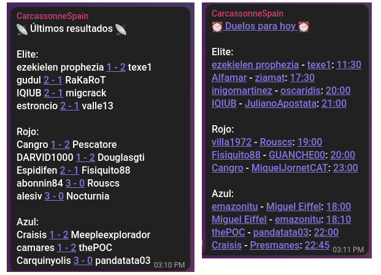

# 🤖 carcassonne-spain-telegram-bot
Send updates about [Carcassonne Spain](https://carcassonnespain.es/) league to Telegram groups. Also tweets them.



## 📦 Setup

### Telegram bot

You need to create a Telegram bot in case you don't have one:

1. Open a chat with [BotFather](https://t.me/BotFather).
2. Type */newbot* and follow BotFather instructions.

Once you are done, edit [config.yml](config.yml) and fill your Telegram token.

### Twitter bot

You need to go to https://developer.twitter.com , get your tokens and put them in [config.yml](config.yml).

### Dependencies

```bash
$ pip install -r requirements.txt
```

Or using Docker:

```bash
$ docker build -t carcassonnespain .
```

## 🚀 Usage

```bash
$ bin/telegram_bot
```

```bash
$ bin/twitter_bot
```

Again, if you prefer to use Docker:

```bash
$ docker run carcassonnespain
```

```shell
$ docker run --entrypoint bin/twitter_bot carcassonnespain 
```

Once *telegram_bot* is running, it will start to send daily updates to all the groups at the time specified in [config.yml](config.yml).

*twitter_bot* simply tweets when you run it. Hence you need to put it in cron to get daily updates.

## 🧪 Testing

When you run the bot, you get the outcome for games played yesterday and the schedule for games that will be played today.

For testing purposes, you can pretend that today is a different day. You can also use the *--test* flag so nothing is send to telegram/twitter, messages will be printed instead.

```bash
$ bin/telegram_bot --today 2022-11-01 --test
```

```bash
$ bin/twitter_bot --today 2022-11-01 --test
```

## 👷 Contributing

Code simply retrieves some csv files, generate a message and publish it in Telegram/Twitter. All the csv reading and parsing is done under [src/cs/](src/cs/). Telegram/Twitter stuff is inside [src/io/](src/io/).

Before submitting code, check everything is all right by running:

```bash
$ python -m unittest
$ pylint --errors-only $(git ls-files '*.py')
```

## 📜 License

[GPL v3](https://www.gnu.org/licenses/gpl-3.0.en.html)

